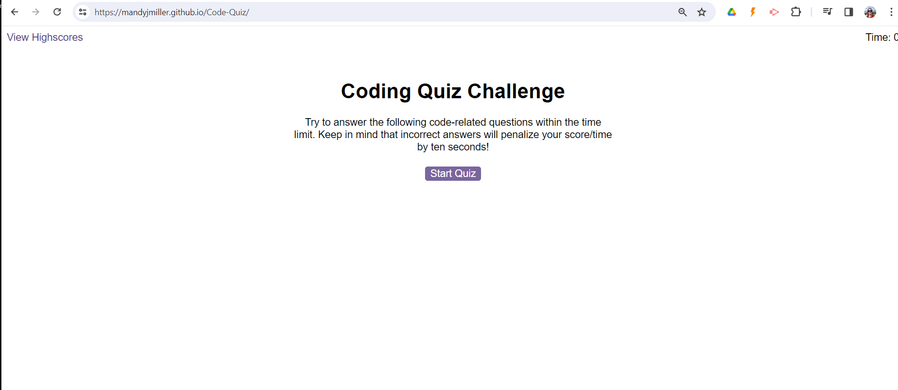

# Code-Quiz
A timed quiz using JavaScript fundamentals that stores high scores

## User Story
AS A coding boot camp student
I WANT to take a timed quiz on JavaScript fundamentals that stores high scores
SO THAT I can gauge my progress compared to my peers

## Acceptance Criteria

I will have met the brief when the following acceptance criteria are met:

Create a code quiz that contains the following requirements:

* A start button that when clicked a timer starts and the first question appears.
 
  * Questions contain buttons for each answer.
  * When answer is clicked, the next question appears
  * If the answer clicked was incorrect then subtract time from the clock

* The quiz should end when all questions are answered or the timer reaches 0.

  * When the game ends, it should display their score and give the user the ability to save their initials and their score

## Installation

No particular installation requirements. Web page can be viewed using Chrome, Firefox, Safari or most other standard browser, using "Inspect" Console to see the output 
The "Application" tab in Inspect can be used to see the scores which have been saved to LocalStorage.

## Usage 

This site can be accessed on GitPages [HERE](https://mandyjmiller.github.io/Code-Quiz/)

Screenshot of the site can be seen here:

## Credits

Shout out to the teaching team at EdX and fellow students for help and collaboration.

This week's challenge was difficult, so there was a lot of Googling and referring to YouTube Tutorials.

Particular credit to the following sites and Channels for inspiration and detailed walk throughs :-) :

https://www.youtube.com/watch?v=riDzcEQbX6k

https://simplestepscode.com/javascript-quiz-tutorial

https://webdesign.tutsplus.com/multiple-choice-quiz-app-with-javascript--cms-107756t

Other Tutorials and base materials from  [Module 6 Challenge](https://bootcampspot.instructure.com/courses/5651/assignments/67068)

... and the wider community at [StackOverflow](https://stackoverflow.com/questions/70879043/javascript-quiz-with-html-css) for general syntax and troubleshooting when losing the will to live. Thanks! 

## License

MIT License

Copyright (c) 2023 Mandy Miller

Permission is hereby granted, free of charge, to any person obtaining a copy
of this software and associated documentation files (the "Software"), to deal
in the Software without restriction, including without limitation the rights
to use, copy, modify, merge, publish, distribute, sublicense, and/or sell
copies of the Software, and to permit persons to whom the Software is
furnished to do so, subject to the following conditions:

The above copyright notice and this permission notice shall be included in all
copies or substantial portions of the Software.

THE SOFTWARE IS PROVIDED "AS IS", WITHOUT WARRANTY OF ANY KIND, EXPRESS OR
IMPLIED, INCLUDING BUT NOT LIMITED TO THE WARRANTIES OF MERCHANTABILITY,
FITNESS FOR A PARTICULAR PURPOSE AND NONINFRINGEMENT. IN NO EVENT SHALL THE
AUTHORS OR COPYRIGHT HOLDERS BE LIABLE FOR ANY CLAIM, DAMAGES OR OTHER
LIABILITY, WHETHER IN AN ACTION OF CONTRACT, TORT OR OTHERWISE, ARISING FROM,
OUT OF OR IN CONNECTION WITH THE SOFTWARE OR THE USE OR OTHER DEALINGS IN THE
SOFTWARE.

---

© 2023 edX Boot Camps LLC. Confidential and Proprietary. All Rights Reserved.
